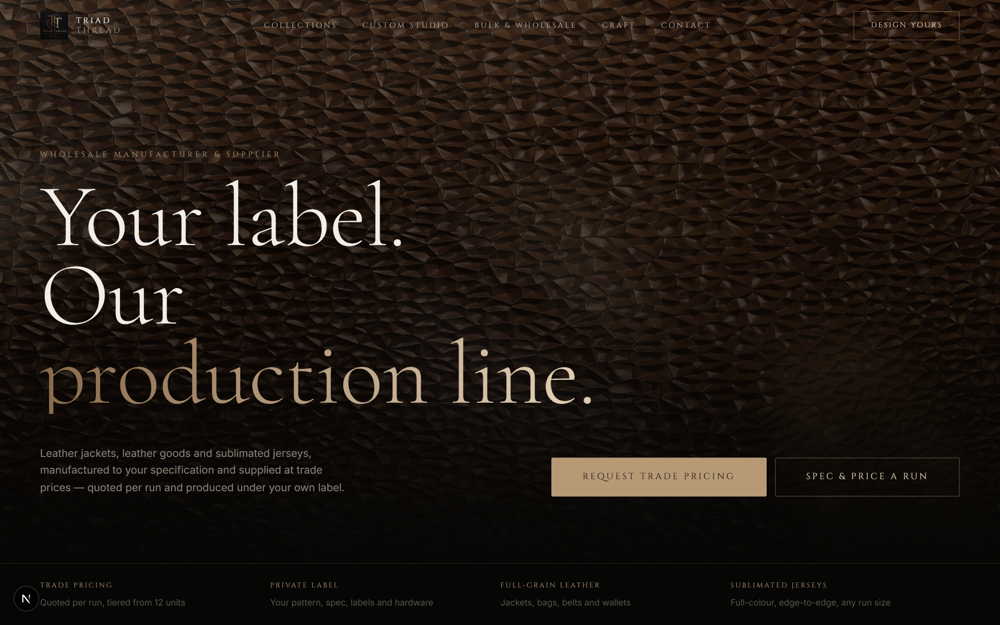
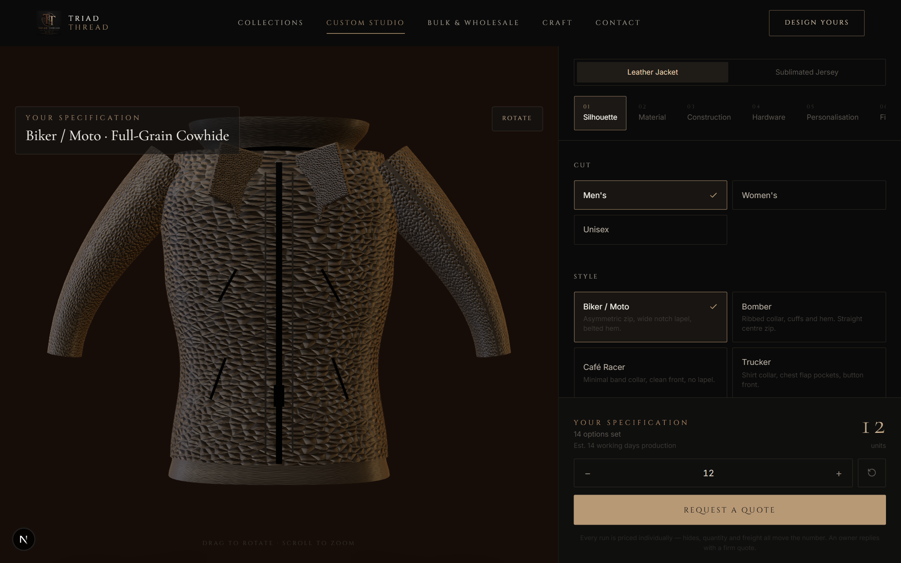
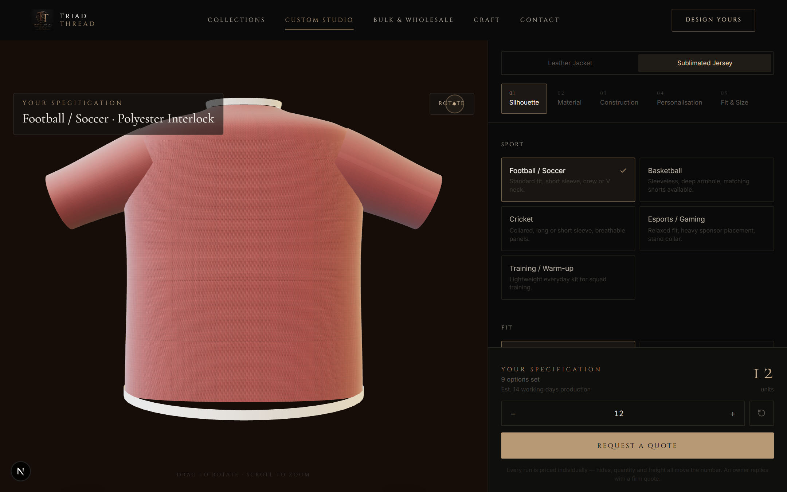
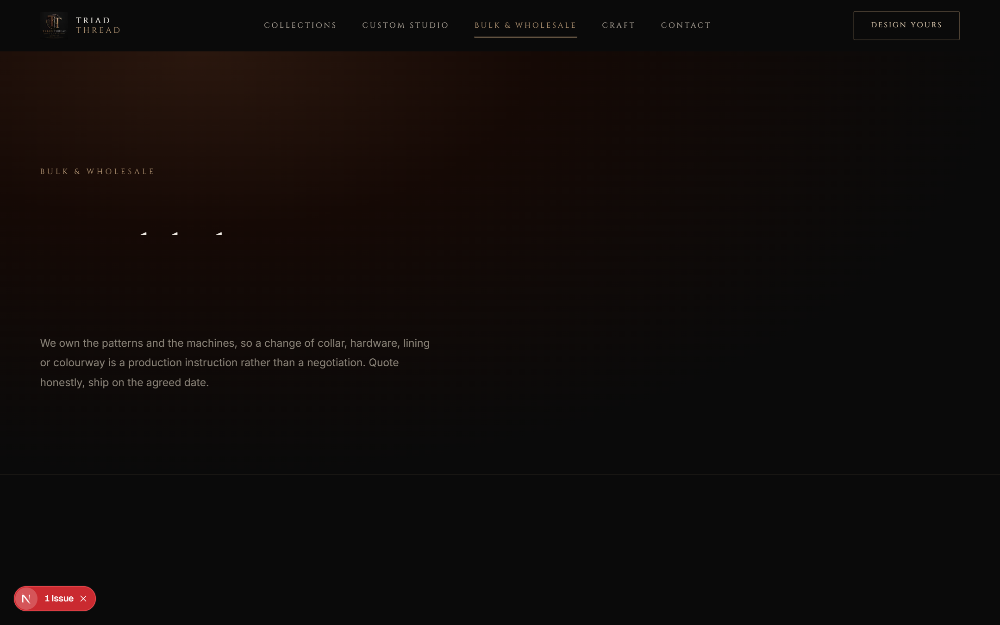
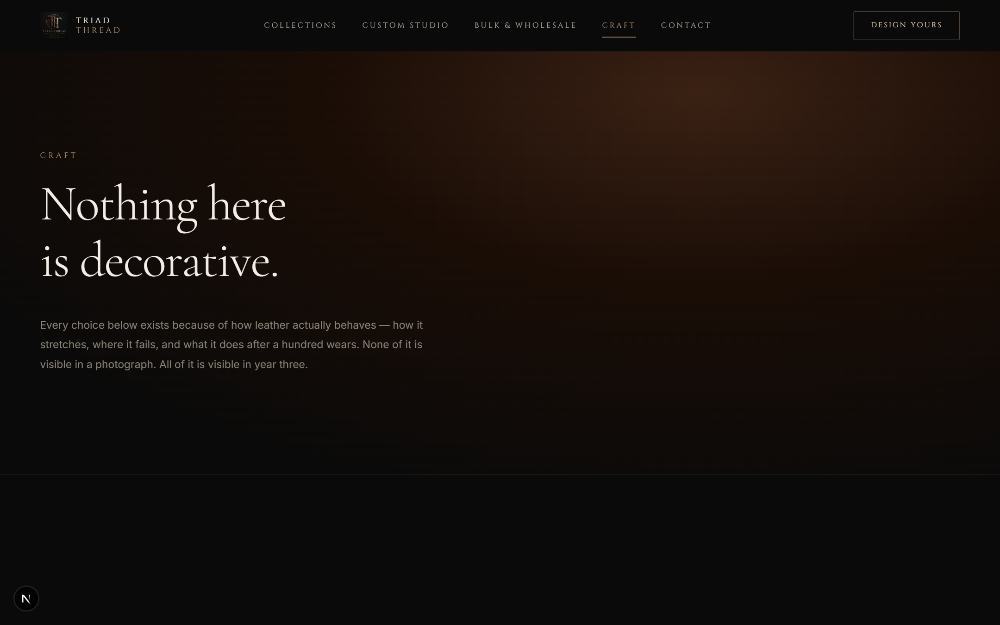
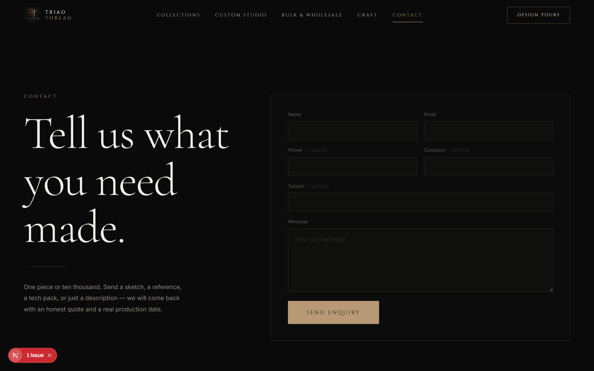
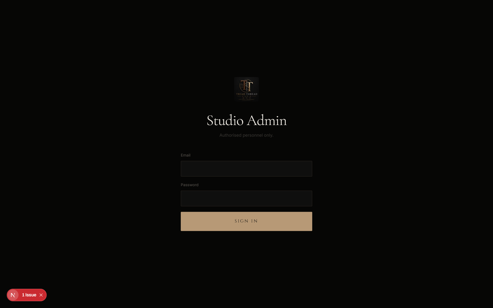
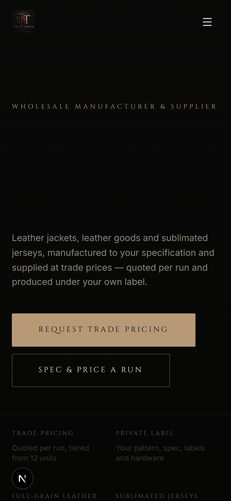

# Triad Thread Studio — Case Study

A wholesale manufacturing platform I designed and built end to end: a luxury
marketing site, a live 3D product configurator, a quote-request pipeline, and
an admin back office the owners run the business from.

**Live site:** https://triad-thread-studio.vercel.app
**Client:** Triad Thread Studio — leather jackets, leather goods and
sublimated jerseys, supplied wholesale.

---

## The site

*Homepage. The leather behind the headline is generated at runtime, not photographed.*

*Custom studio. Every option updates the 3D garment live; the panel captures a full specification for quoting.*

*Second product line, with its own option set, silhouette and woven-fabric material.*

*Wholesale page. Named tiers rather than a published rate card — every run is quoted individually.*

*Craft page, written from how leather actually behaves. Named owners, because a buyer committing to a production run wants to know who they are dealing with.*

*Enquiry capture. Saved to the database before the notification email, so an SMTP outage cannot lose a lead.*

*Admin sign-in. Unlinked, noindexed, robots-blocked, and gated at both middleware and layout.*

*Mobile. Most trade buyers open a supplier's site on a phone.*

---

## The brief

A wholesale manufacturer with no website, no product photography, and three
owners who needed to take trade enquiries without hiring a developer to change
a price or add a product.

## What I built

**Marketing site** — dark luxury design system whose entire palette was derived
by pixel-sampling the client's own logo rather than guessed. Cinematic 3D hero,
scroll-driven reveals, full reduced-motion support.

**3D custom studio** — buyers specify a jacket or a jersey option by option and
watch it update live in 3D. Two product lines, each with its own option set,
silhouette and material model.

**Quote pipeline** — the site captures the full specification and routes it to
the owners, who price each run themselves. Wholesale prices move with run size,
hide availability and freight, so a published rate card would be a promise the
business could not keep.

**Admin back office** — orders with a guarded status workflow, an enquiry
inbox, and product/collection management, so the owners add stock and move jobs
along without touching code.

---

## Problems worth describing

**No product photography, and none available.** The images I was given were
other companies' — one carried a stock-library watermark, another was a
licensed sports kit. Using them would have been infringement, and it would have
undercut the site's whole claim to manufacture what it sells.

So the product imagery is generated. Leather is synthesised at runtime from
Worley noise into albedo, normal and roughness maps; jersey fabric is a
separate generator that interlaces warp and weft, because a knit rendered with
a leather shader reads as plastic. Garments are lofted from cross-sections, and
every product card renders through one shared WebGL context rather than one
canvas each — browsers cap live contexts and would blank cards as you scroll.

Result: zero licensing exposure, and imagery that always matches what the
customer can actually order.

**A price a buyer can forge is a price you will honour.** Before the model
moved to quote-on-request, the order endpoint recomputed every total server
side from a pure function and rejected mismatches. Sending a $1 total for a
$364 jacket returned 409 with the real figure.

**Trust signals cannot be invented.** Unverified business details are explicit
placeholders that render as nothing rather than as plausible fiction, and a
launch gate fails the build while any remain. A guessed address or lead time on
a manufacturer's site costs more than an omission.

---

## Stack

Next.js 16 · TypeScript · Tailwind CSS 4 · React Three Fiber · Three.js ·
Prisma 7 · PostgreSQL · Zod · Framer Motion · Vercel

Every dependency is free-tier.

---

## Engineering notes

- **50 tests** across pricing, request validation and 3D geometry. All money is
  integer cents; a test asserts no float ever enters the pricing path.
- **Security**: bcrypt at 12 rounds, stateless JWT sessions with a revocation
  path, per-IP rate limiting, CSP and full security headers, Zod validation on
  every boundary, and server actions that re-check the session themselves —
  a `"use server"` function is a public POST endpoint, so gating the page is
  not gating the action.
- **Accessibility**: reduced-motion honoured throughout, keyboard reachable,
  labelled controls, and 3D that degrades to static rather than disappearing.
- **SEO**: metadata API, Organization/Product/Breadcrumb/FAQ structured data,
  generated sitemap, and preview deployments blocked from indexing.

---

## Contact

**Muhammad Abdullah Rathore** — AI Integration & Automation Developer
[github.com/AbdullahRathoreVA](https://github.com/AbdullahRathoreVA)
